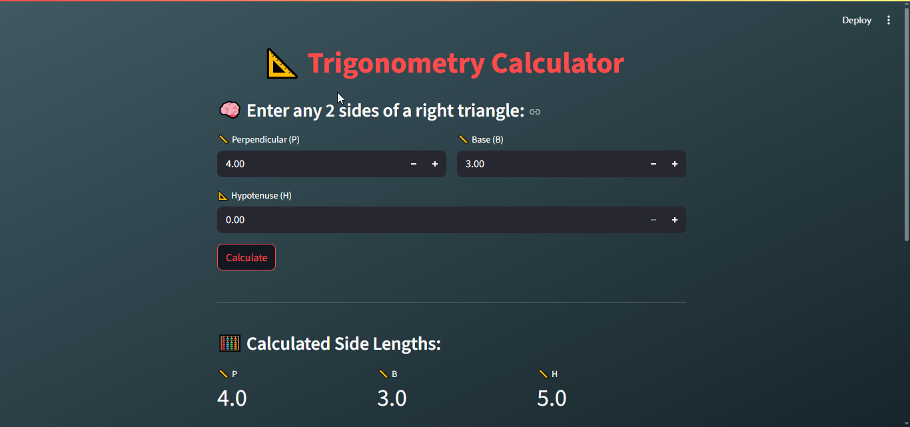

# 📐 TrigoCalc

A clean, mobile-friendly **Trigonometry Calculator** built with Python + Streamlit.  
Enter any 2 sides of a right triangle, and TrigoCalc auto-solves the third + shows all 6 trigonometric ratios in seconds. No math trauma, just vibes.

---

### 🌟 Features

- 🧠 Calculates missing triangle side (P, B, H)  
- 📊 Displays all 6 trig ratios:
  - `sin(θ)`, `cos(θ)`, `tan(θ)`
  - `cot(θ)`, `sec(θ)`, `cosec(θ)`
- 🧮 Smart error handling (no zero-division, no invalid triangles)
- 📱 **Fully mobile-friendly UI** using Streamlit
- 🧨 No login, no ads, just math magic

---

### 📸 Screenshot

  


---

### 🚀 Try It Live

🔗 [Live App on Streamlit](https://trigocalc.streamlit.app/)  


---

### 🧑‍💻 Local Setup

1. **Clone the repo**  
   ```bash
   git clone https://github.com/yourusername/Trigocalc.git
   cd TrigoCalc
   ```

2. **Install dependencies**  
   ```bash
   pip install -r requirements.txt
   ```

3. **Run the app**  
   ```bash
   streamlit run main.py
   ```

---

### 📂 Project Structure

```
Trigo calc/
├── main.py
├── requirements.txt
└── README.md
```

---

### 💡 How It Works

- Uses `math.sqrt()` to compute missing side
- Uses basic trig ratio formulas
- Styled with Streamlit markdown + custom CSS for mobile optimization

---

### ✍️ Author

**HEISENDEV** — the myth, the calc, the code.  
If it looks too good to be real... yeah, I made it 😎

---

### 📜 License

MIT License. Free to use, remix, and flex.

---

### 🧪 Future Ideas (Optional)

- Angle calculator using `math.asin`, `acos`, `atan`
- Interactive triangle diagram
- Dark mode toggle 🌙